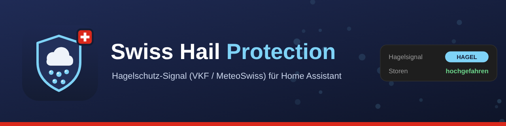

# Swiss Hail Protection (VKF / MeteoSwiss)

[](https://github.com/hacs/integration)
[](LICENSE)
<a href="https://www.buymeacoffee.com/prusuino"></a>



A Home Assistant custom integration that brings a Swiss hail signal into Home Assistant — so your blinds can be raised before the hail arrives, by your own automations. Two sources, chosen when you add the integration:

| | **VKF hail-warning signal** | **MeteoSwiss hail radar** |
|---|---|---|
| What it is | The signal of «Hagelschutz – einfach automatisch», the hail-protection system of the Swiss cantonal building insurers (VKF / AEAI / AICAA), computed by SRF Meteo for your registered building | The open-data hail radar products of MeteoSwiss: probability of hail (POH) and expected hail size (MESHS) on a 1 km grid, evaluated around a location you choose |
| Lead time | About 20 minutes before the hail reaches the building (cell tracking and forecast) | None by itself — the radar shows where hail is now; lead time comes from the radius you configure |
| Access | A device registered with the VKF (serial + interface id), see [Getting access](#getting-access-vkf-device-serial-and-interface-id) | Free, no registration; any location in Switzerland and its immediate surroundings |
| Season | All year | Products are only computed from 1 April to 30 September |
| Refresh | Every 120 seconds (as the VKF specification requires) | Every 5 minutes (as the products are published) |
| Privacy | Device serial and interface id are sent with every poll | Nothing about your location leaves your instance — one file covers all of Switzerland |

Both sources expose the **same alarm binary sensor**, so an automation written for one works unchanged with the other — and you can run both side by side, each as its own entry.

## Background

Hail is the single most expensive natural hazard for buildings in Switzerland, and most of the damage is to blinds and shutters. The cantonal building insurers therefore run **«Hagelschutz – einfach automatisch»**, developed with SRF Meteo: a nowcast predicts hail cells for every registered building, and a warning signal tells the building to raise its blinds in time. When the danger has passed, the signal is cleared and the blinds may return to their previous position. Traditionally the signal reaches the building through a **VKF signal box**, a small device with a relay that the blind controller is wired to. Building control systems that can talk HTTP do not need the box: the VKF documents a **REST interface** that delivers the same signal, and that is what the VKF source of this integration polls.

**MeteoSwiss**, the Federal Office of Meteorology and Climatology, publishes its radar-based hail products as Open Government Data since 2025: every five minutes, for every square kilometre of the Swiss radar composite, the **probability of hail** (POH, 0–100 %) and the **maximum expected severe hail size** (MESHS, in millimetres for hail above 2 cm). The MeteoSwiss source of this integration downloads the newest product, looks at the cells within a radius of your location and raises the alarm when the probability of hail in that circle reaches your threshold. It is not a forecast — but a cell 10 km away at the usual 30–60 km/h of a thunderstorm is 10–20 minutes away, which is why the radius is the knob that trades lead time against false alarms.

Whichever source you use, the integration does one thing: it exposes whether a hail warning is active. What the house does with it is entirely up to your automations.

## Getting access (VKF): the device serial and interface id

The VKF service is **not public**. It only answers for a device the VKF has registered, and the two values the VKF source asks for — the **device serial (`deviceId`)** and the **interface id (`hwtypeId`)** — are issued by the VKF at registration. You cannot pick them yourself, and the service answers *device not found* for anything it does not know. This is how you get them:

1. **Apply through the official site.** Fill in the interest form at [hagelschutz-einfach-automatisch.ch](https://www.hagelschutz-einfach-automatisch.ch/elektriker-architekten-planer/produkt/ich-habe-interesse.html). Your request goes to the cantonal building insurer responsible for your building, which also checks the financing — the signal box and the platform are free of charge, paid for by the cantonal building insurers; you only carry the internet connection and, for a box, the electrician.
2. **Say that you will use the REST interface.** The default delivery is a VKF signal box, a small device with a relay that an electrician wires to the blind controller. Home Assistant does not need it: state in the application that your building control system fetches the signal directly over the **METEO REST API** («Schnittstelle»), as described in the VKF interface sheet. The VKF then registers your installation as a building control system without a box.
3. **What you receive:** a login for the operator portal [meteo.netitservices.com](https://meteo.netitservices.com) and the completed **interface sheet** with the two fields *MAC-Adresse (deviceID)* and *Schnittstelle (hwtypeId)*. Those are the values you enter in the integration's setup dialog — nothing else is needed.
4. **If you already own a signal box,** its MAC address is the device serial; the interface id for the box is on the same sheet. The integration can poll alongside the box, so Home Assistant sees the same signal the relay switches.
5. **Finish the VKF procedure.** After setup, run the function test from the portal (switch on *Testalarm*, see [Function test](#function-test-vkf)), activate the alarm chain and return the signed acceptance protocol to the VKF — that part is yours, not the integration's.

Note that the VKF designed the system primarily for larger industrial, commercial and office buildings; owners of smaller buildings can apply too, and the VKF publishes a separate information sheet for them. The MeteoSwiss source needs none of this.

## What it provides

### Both sources

| Entity | Description |
|---|---|
| `binary_sensor.swiss_hail_protection_alarm_<id>` | **The signal to act on.** `on` while the source signals hail. VKF: for a real warning and for a test alarm alike, exactly as the VKF signal box closes its relay in both cases. MeteoSwiss: while the probability of hail within the radius reaches the threshold. Device class *safety*. Attribute `source` (`vkf` / `meteoswiss`) plus the source's details (below). |
| `sensor.swiss_hail_protection_status_<id>` | The state as a readable value: `no_hail`, `hail`, `test_alarm` (VKF only) or `off_season` (MeteoSwiss only, October to March), translated in the frontend. For dashboards and for telling a test alarm apart in a notification — automations should trigger on the binary sensor. |

### MeteoSwiss source only

| Entity | Description |
|---|---|
| `sensor.swiss_hail_protection_probability_<id>` | Highest probability of hail (POH) within the radius, in %. Attributes: `poh_home` (the value in your own cell), `hail_cells` (cells within the radius at or above the threshold), `nearest_hail_km` (distance to the closest such cell), `radar_time`. |
| `sensor.swiss_hail_protection_hail_size_<id>` | Largest expected severe hail size (MESHS) within the radius, in mm. `0` when no cell in the circle expects severe hail. |
| `sensor.swiss_hail_protection_radar_time_<id>` | Nominal time of the radar product the values are based on (diagnostic). |

The alarm binary sensor of a MeteoSwiss entry carries `radar_time`, `poh_max`, `poh_home`, `meshs_max`, `hail_cells`, `nearest_hail_km`, `radius_km` and `poh_threshold` as attributes; that of a VKF entry carries `state_code` (the raw value, 0/1/2) and `test_alarm`.

`<id>` is a four-character tag of the config entry (the last four characters of its id, lower-cased), so a second entry gets distinct entity ids. These are the ids suggested when an entity is first created; any entity can be renamed in its settings.

All entities become **unavailable** while their data service is unreachable, refuses the poll or has published no product for the last 20 minutes, and come back on the next successful refresh — they never show a stale value. The VKF portal, for its part, notifies the registered contacts when a device has not polled for an hour (the *Alarmkette*), so an outage on either side is noticed.

## Language

Entity names, the device name/manufacturer/model, the config flow and the sensor states adapt to your Home Assistant language — German, English, French and Italian are supported, with English as the fallback.

## Installation

### HACS (recommended)

1. Open **HACS**, search for **"Swiss Hail Protection"** and download it — or use the button, which opens the integration directly in your HACS:

   [](https://my.home-assistant.io/redirect/hacs_repository/?owner=prusuino&repository=ha_swiss_hail_protection&category=integration)

2. Restart Home Assistant.

Until the integration shows up in the HACS search, the button above adds it as a custom repository.

### Manual

1. Copy the `custom_components/swiss_hail_protection` folder into your Home Assistant `config/custom_components/` directory.
2. Restart Home Assistant.

The MeteoSwiss source reads the radar files with [pyfive](https://github.com/jjhelmus/pyfive), a pure-Python HDF5 reader; Home Assistant installs it (and NumPy) automatically when the integration is first set up. No HDF5 system library is needed.

## Setup

1. Go to **Settings → Devices & Services → Add Integration**.
2. Search for **"Swiss Hail Protection"**.
3. Choose the source:
   - **VKF hail-warning signal:** enter the **device serial** (`deviceId`) and the **interface id** (`hwtypeId`) from your VKF interface sheet (see [Getting access](#getting-access-vkf-device-serial-and-interface-id)). The serial is letters and digits; the form upper-cases it for you. The integration polls the service once with the values you entered: an unknown serial, an exhausted quota or an unreachable service shows up right here instead of as a failed setup afterwards.
   - **MeteoSwiss hail radar:** latitude and longitude default to your Home Assistant home location; set the **radius** (default 10 km, up to 50 km) and the **alarm threshold** (probability of hail at which a cell counts as hail, default 80 %). The integration fetches the newest product once to make sure the service is reachable and your location lies inside the radar composite.
4. Submit. Add the integration again for a second registered device, a second location, or to run both sources side by side — each entry is independent.

If the VKF service stops recognising the serial later (the VKF reassigned or deactivated the device, say), Home Assistant asks you to **reauthenticate** and you enter the current values. **Reconfigure** on an entry changes its serial and interface id, or its location, radius and threshold, at any time.

## Automations

The VKF expects the building to **raise the blinds fully** while the signal is active and to restore them afterwards; the same makes sense for the radar alarm. A minimal pair of automations:

```yaml
automation:
  - alias: "Hail warning: raise blinds"
    triggers:
      - trigger: state
        entity_id: binary_sensor.swiss_hail_protection_alarm_7f3a
        to: "on"
    actions:
      - action: scene.create
        data:
          scene_id: blinds_before_hail
          snapshot_entities:
            - cover.living_room
            - cover.kitchen
      - action: cover.open_cover
        target:
          entity_id:
            - cover.living_room
            - cover.kitchen

  - alias: "Hail warning cleared: restore blinds"
    triggers:
      - trigger: state
        entity_id: binary_sensor.swiss_hail_protection_alarm_7f3a
        from: "on"
        to: "off"
    actions:
      - action: scene.turn_on
        target:
          entity_id: scene.blinds_before_hail
```

Three things worth building in:

- **Let the warning win.** While the alarm is `on`, your other blind automations (sun shading, wind, schedules) should not lower the blinds again — add a condition on the binary sensor to them, or stop them with the first automation and resume them with the second.
- **Trigger on `on`, not on a status text.** The binary sensor is `on` for a real VKF warning, for a VKF test alarm, for any state the VKF might add in the future, and for a radar alarm. Use the `test_alarm` attribute (or the status sensor) only to word a notification differently — the blinds should move in both cases, that is what the VKF function test checks.
- **With the radar source, add a hold time.** A cell can dip below the threshold for one five-minute product and be back the next. If your blinds should not go up and down in between, let the "cleared" automation wait, for example with a `for: "00:15:00"` on the `off` trigger.

### Function test (VKF)

The VKF asks every installation to run a **function test** before activating the alarm chain: in the portal at meteo.netitservices.com, switch on the *Testalarm*; within two minutes the binary sensor turns `on` and your blinds should go up; switch the test alarm off and, after the next poll, the sensor turns `off` and the blinds should return. The portal's activity log shows both the delivery and the pick-up of the test alarm. Completing the VKF acceptance protocol is still the owner's job — the integration does not replace it.

## Notes

- **VKF polling.** The service recalculates the hail forecast every five minutes and requires clients to poll every 120 seconds; the integration polls at exactly that interval, and it is not configurable. The service also caps the number of polls per device and day; the 120-second cadence stays within it with room for a few restarts, and if the cap is ever hit the entities go unavailable until the next accepted poll instead of the integration guessing.
- **MeteoSwiss polling.** The products are published every five minutes, about one to two minutes after their nominal time. The integration checks every five minutes, fetches the newest product that exists (walking back up to four slots) and skips the download when it already has that product. Each product is one file of well under a megabyte for all of Switzerland.
- **MeteoSwiss season.** POH and MESHS are only computed from 1 April to 30 September; outside that window MeteoSwiss publishes empty files, the status sensor shows *off season*, and the alarm stays off. Should hail appear in the data outside the season anyway, the data wins and the alarm fires.
- **What leaves your instance.** VKF: with every refresh, the device serial (in the URL path) and the interface id (as a query parameter) are sent to `https://meteo.netitservices.com/api/v1/devices/<deviceId>/poll` over HTTPS — nothing else. The serial is the service's only credential: it is stored with your config entry, never written to the log (a failed request is logged with its error type or HTTP status and the service's exception name, not with the URL), and shown only in the form you fill in yourself. MeteoSwiss: the integration downloads files from `https://data.geo.admin.ch/ch.meteoschweiz.ogd-radar-hail/` whose names contain only the product and the time; your coordinates, radius and threshold are used on your own machine and are never sent anywhere. See [SECURITY.md](SECURITY.md).
- **An undocumented VKF state code** (a value other than 0, 1 or 2) is treated as an active warning, following the VKF's advice to read the state as zero / non-zero; the status sensor shows *unknown* for it, and a warning is logged once.
- The integration does not use the VKF error-report endpoint; it only reads.
- This integration is unofficial and not affiliated with, endorsed by, or supported by the VKF, SRF Meteo, NetITServices or MeteoSwiss. See [NOTICE.md](NOTICE.md).

## Data sources

The VKF hail-warning signal is provided by the VKF's «Hagelschutz – einfach automatisch» service for registered devices only, under the terms you accept at registration. The hail radar products are Open Government Data of MeteoSwiss and require the attribution *Source: MeteoSwiss*. See [NOTICE.md](NOTICE.md) for both. Every entity sets Home Assistant's `attribution` attribute accordingly.

## Disclaimer

This integration is provided **as-is, without any warranty**. The signal is retrieved from third-party services and may be delayed, incorrect or unavailable, and the integration may stop working if a service changes. **It controls nothing by itself** — what your blinds do is decided by automations you write, so test them, including the VKF function test, before relying on them, and keep in mind that no hail warning is perfect: the radar source in particular only sees hail that already exists, and a cell can reach you faster than the radius suggests or miss you entirely. Do not rely on this integration as your only protection against hail damage. The author(s) accept **no responsibility or liability** for any damage, loss, missed warning or other issues arising from using this integration, whether it stops working, behaves unexpectedly, or never worked correctly for your setup in the first place.

## License

Source code: MIT — see [LICENSE](LICENSE). The hail-warning signal and the radar products: see [NOTICE.md](NOTICE.md).

## Related integrations

More Home Assistant integrations from the same author:

- [Swiss Public Alerts](https://github.com/prusuino/ha_swiss_public_alerts) — official Swiss public alerts (Alertswiss) with home-location matching
- [Swiss Waters](https://github.com/prusuino/ha_swiss_waters) — live water temperature, water level, discharge and flood danger levels of Swiss rivers and lakes
- [Swiss Earthquakes](https://github.com/prusuino/ha_swiss_earthquakes) — recent Swiss earthquakes on a map (SED)
- [Swiss Avalanche Bulletin](https://github.com/prusuino/ha_swiss_avalanche_bulletin) — the official SLF avalanche bulletin for your location
- [Swiss Charging Stations](https://github.com/prusuino/ha_swiss_charging_stations) — real-time availability and prices of public EV charging stations in Switzerland
- [Austrian Charging Stations](https://github.com/prusuino/ha_austrian_charging_stations) — real-time availability of public EV charging stations in Austria
- [Swiss Transport](https://github.com/prusuino/ha_swiss_transport) — live public-transport departure boards and saved connections
- [Swiss Parking](https://github.com/prusuino/ha_swiss_parking) — live free parking spaces in Swiss cities
- [Swiss Electricity Price](https://github.com/prusuino/ha_swiss_electricity_price) — electricity tariffs of any Swiss grid operator (ElCom)
- [Swiss Solar Reference Price](https://github.com/prusuino/ha_swiss_solar_reference_price) — the Swiss solar reference market price (SFOE)
- [Innoxel Master 3](https://github.com/prusuino/ha_innoxel_master3) — local control of the Innoxel Master 3 home-automation system

## Support

If this integration is useful to you, you can support its development:

<a href="https://www.buymeacoffee.com/prusuino"></a>
